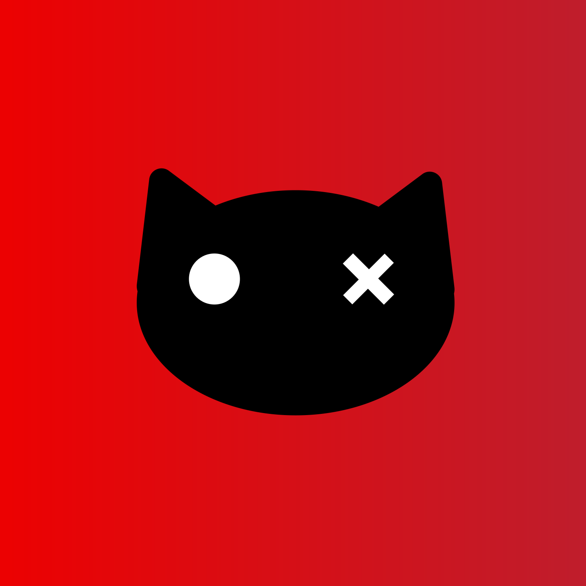

[![Contributors][contributors-shield]][contributors-url]
[![Forks][forks-shield]][forks-url]
[![Stargazers][stars-shield]][stars-url]
[![Issues][issues-shield]][issues-url]

<!-- PROJECT LOGO -->
 

  <h1>Schrödinger Hat Nuxt Template</h1>

  

  

    <a href="https://github.com/Schrodinger-Hat/template/blob/main/README.md"><strong>Explore the docs »</strong></a>
     
     
    <a href="https://github.com/Schrodinger-Hat/Template/issues">Report Bug</a>
    ·
    <a href="https://github.com/Schrodinger-Hat/Template/issues">Request Feature</a>
  

<!-- TABLE OF CONTENTS -->

  
Table of Contents

  <ol>
    <li>
      <a href="#about-the-project">About The Project</a>
      <ul>
        <li><a href="#tech-stack">Built With</a></li>
      </ul>
    </li>
    <li><a href="#usage">Usage</a></li>
    <li><a href="#contributing">Contributing</a></li>
    <li><a href="#contact">Contact</a></li>
  </ol>

<!-- ABOUT THE PROJECT -->
## About The Project

This project, developed by the Schrödinger Hat team, is an opinionated, robust, and efficient Nuxt.js template. It's designed to serve as a minimalistic yet expandable starting point for both simple and complex web applications. The template incorporates best practices and cutting-edge technologies from the Vue and Nuxt ecosystem. With scalability at its core, it can adapt to the increasing demands and complexities of any project, providing a solid and efficient foundation that can be customized to suit your needs.

### Tech stack

This project is built with a number of leading-edge technologies to ensure maximum efficiency and performance.
In this project, the technologies utilized are:

- [Nuxt3](https://nuxt.com/)
- [SASS](https://sass-lang.com/)
- [Shadcn Vue](https://www.shadcn-vue.com/)
- [TailwindCSS](https://tailwindcss.com/)
- [Typescript](https://www.typescriptlang.org/)
- [Vue3](https://vuejs.org/)

Nuxt modules utilized:
- [Nuxt Icon ](https://nuxt.com/modules/icon)
- [Nuxt SVGO](https://nuxt.com/modules/nuxt-svgo)
- [Nuxt Test Utils](https://github.com/nuxt/test-utils)
- [VueUse](https://nuxt.com/modules/vueuse)

## Usage

To use this template, simply clone the repository to your local machine, install the necessary dependencies with `pnpm install`, and start the development server with `pnpm run dev`.

You can also utilize the template when creating a new repository directly from GitHub.

If you need to add more modules go over to the [Nuxt Modules](https://nuxt.com/modules) page and follow the instructions listed over there to add one as needed.

## Contributing

Contributions are what make the open source community such an amazing place to learn, inspire, and create. Any contributions you make are **greatly appreciated**.

If you have a suggestion that would make this better, please fork the repo and create a pull request. You can also simply open an issue with the tag "enhancement".
Don't forget to give the project a star! Thanks again!

<!-- CONTACT -->

## Contact

Schrödinger's Hat Team - [@schrodinger_hat](mailto:schrodinger.hat.show@gmail.com)

Project Link: [Schrödinger Hat Nuxt template](https://github.com/Schrodinger-Hat/sh-nuxt-template)

<!-- MARKDOWN LINKS & IMAGES -->
<!-- https://www.markdownguide.org/basic-syntax/#reference-style-links -->

[contributors-shield]: https://img.shields.io/github/contributors/Schrodinger-Hat/sh-nuxt-template.svg?style=for-the-badge
[contributors-url]: https://github.com/Schrodinger-Hat/sh-nuxt-template/graphs/contributors
[forks-shield]: https://img.shields.io/github/forks/Schrodinger-Hat/sh-nuxt-template.svg?style=for-the-badge
[forks-url]: https://github.com/Schrodinger-Hat/sh-nuxt-template/network/members
[stars-shield]: https://img.shields.io/github/stars/Schrodinger-Hat/sh-nuxt-template?style=for-the-badge
[stars-url]: https://github.com/Schrodinger-Hat/sh-nuxt-template/stargazers
[issues-shield]: https://img.shields.io/github/issues/Schrodinger-Hat/sh-nuxt-template.svg?style=for-the-badge
[issues-url]: https://github.com/Schrodinger-Hat/sh-nuxt-template/issues
